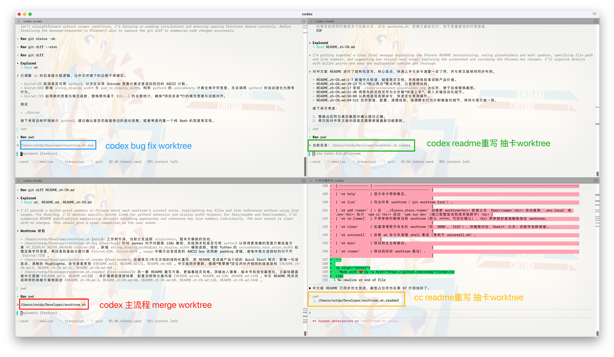

# worktree.sh

[](LICENSE)
[](https://www.gnu.org/software/bash/)
[](https://github.com/notdp/worktree.sh)

**並列開発のためのゼロフリクション git worktree マネージャー**

[English](README.md) • [中文](README.zh-CN.md)

## worktree.sh とは？

worktree.sh は git worktree の面倒なセットアップを自動化します。1つのコマンドで、Codex や Claude Code などのコーディングエージェント用の隔離された開発サンドボックスを作成できます。ブランチ、環境ファイル、依存関係、開発サーバーの起動まですべて含まれており、コンテキストの汚染はありません。

### 最適な用途

- **AI 駆動開発** — Codex と Claude Code のための隔離されたサンドボックス
- **並列開発** — ブランチ切り替えなしで複数の機能を開発
- **クイック実験** — 安全で使い捨て可能な環境
- **コードレビュー** — メイン作業を中断せずにPRをレビュー

## クイックルック



## クイックスタート

### インストール

```bash
curl -fsSL https://raw.githubusercontent.com/notdp/worktree.sh/main/install.sh | bash
```

### 基本的なワークフロー

```bash
# 1. プロジェクトを初期化（メインリポジトリで実行）
wt init

# 2. 機能開発用の worktree を作成
wt add 3000
# これにより自動的に：
# - ../project.3000 に worktree を作成
# - feat/3000 ブランチを作成
# - .env ファイルをコピー
# - 依存関係をインストール
# - ポート3000で開発サーバーを起動

# 3. worktree 間を移動
wt 3000    # 機能 worktree へジャンプ
wt main    # メインリポジトリへ戻る

# 4. 準備ができたらマージ（メイン worktree から）
wt merge 3000

# 5. クリーンアップ
wt rm 3000
```

## コア機能

- **ワンコマンドセットアップ** — `wt add 3000` で worktree、ブランチ作成、env ファイルコピー、依存関係インストール、ポート3000で開発サーバー起動
- **即座にナビゲーション** — `wt 3000` や `wt main` で worktree 間をジャンプ、パスを覚える必要なし
- **スマート同期** — `wt sync all` でメインから複数の worktree へステージされた変更を伝播
- **安全なクリーンアップ** — `wt rm` で worktree とブランチを一緒に削除、`wt clean` でバッチクリーン
- **完全設定可能** — プロジェクトごとにブランチプレフィックス、自動インストール、開発サーバーの動作を制御

## コマンド

### コアコマンド

| コマンド          | 説明                                     | 例              |
| ----------------- | ---------------------------------------- | --------------- |
| `wt init`         | 現在のリポジトリをデフォルトプロジェクトとして初期化 | `wt init`       |
| `wt add <name>`   | 完全に構成された worktree を作成           | `wt add 3000`   |
| `wt <name>`       | worktree へ移動                           | `wt 3000`       |
| `wt main`         | メインリポジトリへ戻る                      | `wt main`       |
| `wt list`         | すべての worktree を表示                   | `wt list`       |
| `wt merge <name>` | 機能ブランチをマージ                        | `wt merge 3000` |

### 同期

| コマンド             | 説明                               | 例                  |
| -------------------- | ---------------------------------- | ------------------- |
| `wt sync all`        | すべての worktree にステージされた変更を同期 | `wt sync all`       |
| `wt sync <names...>` | 特定の worktree に同期              | `wt sync 3000 3001` |

### クリーンアップ

| コマンド          | 説明                           | 例                                |
| ----------------- | ------------------------------ | --------------------------------- |
| `wt rm [name...]` | worktree を削除                 | `wt rm 3000` または `wt rm`（現在） |
| `wt clean`        | 数値 worktree をバッチ削除       | `wt clean`                        |
| `wt detach [-y]`  | すべてのプロジェクト worktree を削除 | `wt detach -y`                    |

### 設定

| コマンド       | 説明                        | 例               |
| -------------- | --------------------------- | ---------------- |
| `wt config`    | プロジェクト設定を表示/変更    | `wt config list` |
| `wt lang`      | CLI 言語を設定 (en/zh)        | `wt lang set zh` |
| `wt theme`     | `wt list` のテーマを切り替え (`box`\|`sage`\|`archer`) | `wt theme set box` |
| `wt help`      | コマンドリファレンスを表示     | `wt help`        |
| `wt reinstall` | 最新バージョンに更新          | `wt reinstall`   |
| `wt uninstall` | worktree.sh を削除           | `wt uninstall`   |

## 高度な機能

### worktree 全体への変更のブロードキャスト

メインから複数の機能ブランチへ未コミットの変更を同時に伝播：

```bash
# メイン worktree で
git add file1.js file2.js    # 変更をステージ
wt sync all                  # すべての worktree に同期
# または特定のものに同期
wt sync 3000 3001
```

> 注意：対象の worktree はクリーンな状態である必要があります

### カスタム設定

```bash
# 自動開発サーバーを無効化
wt config set add.serve-dev.enabled false

# ブランチプレフィックスを変更
wt config set add.branch-prefix "feature/"

# すべての設定を表示
wt config list
```

設定はプロジェクトごとに `~/.worktree.sh/projects/<slug>/config.kv` に保存されます。

## 使用例

### 複数のUIイテレーション

```bash
wt add ui-v1    # 最初のUIアプローチ
wt add ui-v2    # 代替デザイン
wt add ui-v3    # 3番目のバリエーション
# 実装を並べて比較
```

### 並列コードレビュー

```bash
wt add review-pr-123    # PR #123 をレビュー
wt add review-pr-456    # PR #456 をレビュー
wt add review-pr-789    # PR #789 をレビュー
# コンテキスト切り替えなしで複数のレビューを処理
```

### 同時機能開発

```bash
wt add feat-auth        # 認証機能
wt add feat-payment     # 決済統合
wt add feat-dashboard   # ダッシュボードリデザイン
# 複数の機能を並行開発
```

## インストールの詳細

### インストールされるもの

- バイナリ：`~/.local/bin/wt`
- 設定：`~/.worktree.sh/`
- シェルフック：`~/.bashrc` または `~/.zshrc` に追加

### 要件

- Bash 3.0+
- Git 2.17+（worktree サポート）
- macOS または Linux

### 更新

```bash
wt reinstall    # 最新バージョンに更新
```

### アンインストール

```bash
wt uninstall    # またはアンインストールスクリプトを使用：
curl -fsSL https://raw.githubusercontent.com/notdp/worktree.sh/main/uninstall.sh | bash
```

アンインストールは設定を `~/.worktree.sh.backup.<timestamp>` にバックアップします。

---

**ブランチのジャグリングをやめて、機能のシッピングを始めよう。**

worktree.sh はターミナルを同期させ、設定ではなくコードに集中できるようにします。
