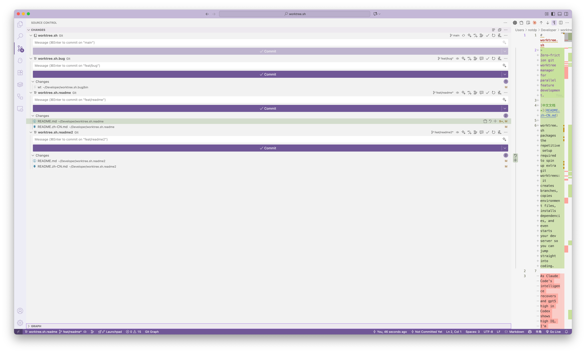

# worktree.sh
>
> 零摩擦的 git worktree 管理助手，让并行开发像开新标签页一样轻松。

[English README »](README.md)

worktree.sh 把创建额外 worktree 所需的繁琐步骤都打包好了：它会自动建分支、复制环境变量、安装依赖，甚至帮你拉起开发服务器，让你直接进入编码状态。

## 核心亮点

- 一条命令即可生成可立即投入开发的 worktree，自动命名分支并保持目录结构干净。
- 使用同一套 CLI 在主仓库和功能分支沙盒之间切换，不用再记路径。
- 可配置的 shell hook 让 `wt` 命令随处可用，并自动切换到正确目录。
- 安全的清理工具能删除过期的 worktree 和分支，同时保留业务数据。

## 为什么你应该尝试使用 worktree

- worktree 提供硬隔离的上下文——文件系统、git 历史、环境变量互不污染——主 Agent 的上下文窗口保持轻量，你也随时能插手调试，不像 Claude Code Subagent 那样不可交互。
- 你可以给高随机性的探索留出单独 worktree——比如用 Claude Code 并行“抽卡”尝试前端 UI——同时让 Codex 处理不互斥的后端任务。
- 随着模型逐渐走向长时运行（几分钟到数十分钟甚至更久），并行的 worktree 是在本地同时运行多个 Agent 或任务的现实方案。
- 对单人开发者而言，可以完全在本地完成 Agent 间的协作；除非要触发 Codex Web / Codex PR Review / Claude Code PR Review 等远端服务，推送远端作为可选项。

## 快速预览




## 快速上手

1. 安装 CLI（自动检测 shell，推荐）：

   ```bash
   curl -fsSL https://raw.githubusercontent.com/notdp/worktree.sh/main/install.sh | bash
   ```

2. 在你想并行开发的仓库中记录默认项目：

   ```bash
   wt init
   ```

3. 创建新的 worktree：

   ```bash
   wt add 3000
   ```

   - 在 `../project.3000` 创建目录
   - 创建并切换到 `feat/3000`
   - 复制 `.env.local` / `.env`
   - 执行 `npm ci`
   - 启动 `npm run dev`，端口取自名称中的数字（如 3000）
4. 随时切换工作上下文：

   ```bash
   wt 3000    # 进入新建的沙盒
   wt main    # 返回主仓库
   ```

5. 功能完成后（已提交）合并回主分支：

   ```bash
   wt merge 3000
   ```

   - 需要在主 worktree（通常为 main）执行，且两侧工作区必须干净。
   - 如果没有新提交或存在未提交修改，命令会提示处理后再重试。

6. 开发结束后清理：

   ```bash
   wt rm 3000
   ```

## 常用命令速查

| 命令             | 说明                                                                         |
| ---------------- | ---------------------------------------------------------------------------- |
| `wt list`        | 展示当前追踪的 worktree（`git worktree list` 包装）。                        |
| `wt add <name>`  | 创建 worktree、分支、复制环境文件、安装依赖并启动 dev server（行为可配置）。 |
| `wt merge <name>` | 将对应的特性分支（`feat/<name>`）合并回基线分支，要求两侧工作区已提交且干净。 |
| `wt <name>`      | 直接进入指定 worktree 目录。                                                 |
| `wt rm [name ...]`   | 删除当前或多个指定的 worktree（默认确认，可加 `--yes` 跳过当前目录）。           |
| `wt clean`       | 批量清理数字命名的 worktree，并删除对应的 `feat/*` 分支。                    |
| `wt main`        | 输出主仓库路径。                                                             |
| `wt config`      | 检查或调整 CLI 行为。                                                        |
| `wt reinstall`   | 依次执行仓库内的 `uninstall.sh` 与 `install.sh`，重新部署 wt。                |
| `wt uninstall`   | 移除二进制并清理 shell hook。                                                |
| `wt help`        | 查看内置命令参考。                                                           |

## 安装选项

安装脚本会把最新的 `bin/wt` 复制到 `~/.local/bin/`，写入 shell 集成，并在路径缺失时提示补充 `PATH`。

- 自动检测（推荐）：

  ```bash
  curl -fsSL https://raw.githubusercontent.com/notdp/worktree.sh/main/install.sh | bash
  ```

- 指定 zsh：

  ```bash
  curl -fsSL https://raw.githubusercontent.com/notdp/worktree.sh/main/install.sh | bash -s -- --shell zsh
  ```

- 指定 bash：

  ```bash
  curl -fsSL https://raw.githubusercontent.com/notdp/worktree.sh/main/install.sh | bash -s -- --shell bash
  ```

安装完成后，重新加载 shell 配置（`source ~/.zshrc` 或 `source ~/.bashrc`），再在目标仓库运行 `wt init` 设置默认项目。

后续如需升级，运行 `wt reinstall` 即可在仓库内串行调用 `./uninstall.sh` 与 `./install.sh`，无需额外手动步骤。

重新安装是幂等操作；若未来出现破坏性变更，仍可先执行 `wt uninstall`，再用安装脚本部署。

## 配置要点

配置保存在 `~/.worktree.sh/config.kv`（key=value 文本），通过 `wt config set` 修改：

```bash
wt config set add.serve-dev.enabled false    # 关闭自动启动 dev server
wt config set add.install-deps.enabled true  # 确保自动安装依赖
wt config set add.branch-prefix "feature/"   # 自定义分支前缀
wt config set language zh                    # 将 CLI 提示切换为中文
wt config list                               # 查看当前配置
```

如需使用其它配置文件路径，可设置环境变量 `WT_CONFIG_FILE`。CLI 会直接读取该文本文件，无需额外缓存或守护进程。

## 清理与卸载

清理过期 worktree 时可连同分支一起处理：

```bash
wt rm              # 提示确认后删除当前 worktree
wt rm feat3001 feat3002    # 一次删除多个指定 worktree
wt clean           # 批量清理所有数字命名的 worktree
```

卸载命令：

```bash
curl -fsSL https://raw.githubusercontent.com/notdp/worktree.sh/main/uninstall.sh | bash
```

或直接运行 `wt uninstall`，它将删除可执行文件、移除以 `# wt shell integration:` 标记的 shell hook，并把 `~/.worktree.sh` 备份到 `~/.worktree.sh.backup.<timestamp>`。

---

如果你经常同时推进多个功能分支，试试 worktree.sh：把精力留给交付，而不是重复性的环境搭建。
